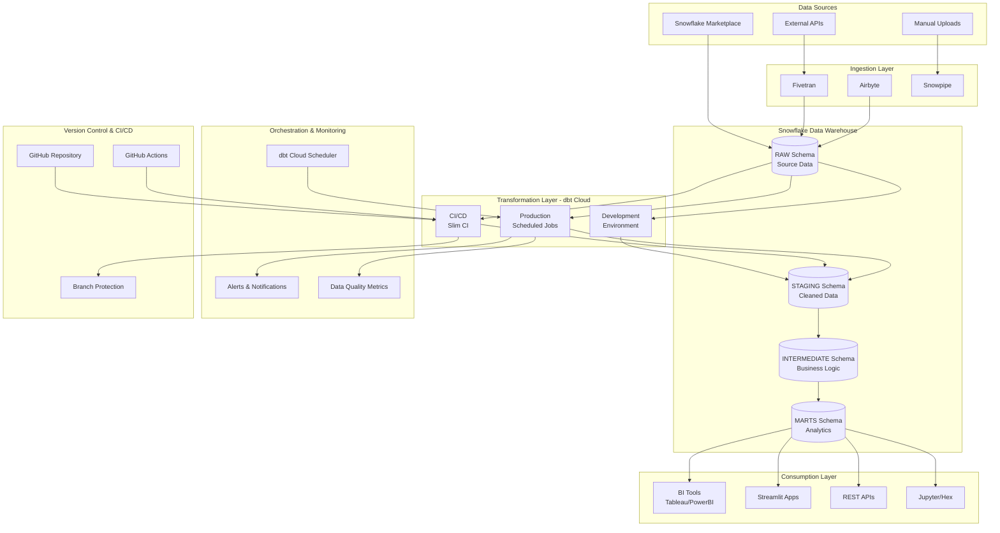

# Production Architecture
## Scalable Data Pipeline for Gym Accessibility Analytics

### Executive Summary

This document outlines a production-ready, scalable architecture for the Gym Accessibility Analytics platform. The architecture is designed to handle:
- **Increased data volumes**: 10x-100x current scale
- **Multiple concurrent developers**: 5-20 team members
- **Multiple concurrent workflows**: Parallel execution of analytics pipelines
- **High availability**: 99.9% uptime SLA
- **Data governance**: Quality, security, and compliance

---

## Architecture Overview



---

## Core Components

### 1. Data Warehouse: Snowflake

**Why Snowflake:**
- Elastic compute scaling (separate compute from storage)
- Zero-copy cloning for dev/test environments
- Native support for semi-structured data (JSON, VARIANT)
- Time travel for data recovery
- Advanced geospatial functions (GEOGRAPHY type)

**Warehouse Strategy:**
```
┌─────────────────┬──────────┬──────────────┬─────────────────┐
│ Warehouse       │ Size     │ Auto-Suspend │ Purpose         │
├─────────────────┼──────────┼──────────────┼─────────────────┤
│ LOADING_WH      │ X-Small  │ 1 min        │ Data ingestion  │
│ TRANSFORMING_WH │ Small    │ 5 min        │ dbt jobs        │
│ BI_WH           │ Medium   │ 10 min       │ BI queries      │
│ DEV_WH          │ X-Small  │ 1 min        │ Development     │
└─────────────────┴──────────┴──────────────┴─────────────────┘
```

**Schema Organization:**
- `RAW`: Source data as-is (read-only after load)
- `STAGING`: Cleaned, typed, deduplicated data
- `INTERMEDIATE`: Business logic, joins, calculations
- `MARTS`: Denormalized, analytics-ready tables
- `DEV_<username>`: Personal dev schemas for developers

### 2. Transformation: dbt Cloud

**Multi-Environment Setup:**

```yaml
# profiles.yml structure
leap_analytics:
  target: dev
  outputs:
    dev:
      type: snowflake
      account: <account>
      database: LEAP_ANALYTICS
      schema: dev_{{ env_var('DBT_USER', 'default') }}
      warehouse: DEV_WH

    ci:
      type: snowflake
      database: LEAP_ANALYTICS
      schema: ci_{{ env_var('DBT_CLOUD_PR_ID', 'temp') }}
      warehouse: TRANSFORMING_WH

    prod:
      type: snowflake
      database: LEAP_ANALYTICS
      schema: prod
      warehouse: TRANSFORMING_WH
```

**dbt Cloud Job Hierarchy:**

1. **Production Job** (Scheduled)
   - Runs: Daily at 6 AM UTC
   - Command: `dbt build --select state:modified+ --defer --state ./prod`
   - Generates docs
   - Sends Slack notifications on failure

2. **Full Refresh Job** (Weekly)
   - Runs: Sunday at 2 AM UTC
   - Command: `dbt build --full-refresh`
   - Rebuilds all incremental models

3. **CI Job** (On PR)
   - Trigger: GitHub PR opened/updated
   - Command: `dbt build --select state:modified+ --defer --state ./prod`
   - Runs only changed models + downstream
   - Blocks merge if tests fail

4. **Data Quality Job** (Hourly)
   - Runs: Every hour
   - Command: `dbt test --select tag:critical`
   - Monitors key metrics

### 3. Version Control & Collaboration

**Branching Strategy (Git Flow):**

```
main (production)
  ↑
  └── develop (integration)
       ↑
       ├── feature/add-new-metrics
       ├── feature/improve-demand-score
       └── bugfix/fix-geography-join
```

**Pull Request Workflow:**

1. Developer creates feature branch from `develop`
2. Makes changes, commits with conventional commits
3. Opens PR with description + screenshots
4. Automated checks run:
   - dbt CI job (Slim CI)
   - SQLFluff linting
   - Pre-commit hooks (YAML validation, trailing spaces)
5. Code review by senior data engineer
6. Merge to `develop` after approval
7. Weekly release: `develop` → `main` (production)

**Branch Protection Rules:**
- Require PR reviews (minimum 1 approval)
- Require CI checks to pass
- No direct commits to `main` or `develop`
- Enforce linear history

### 4. Data Ingestion

**Snowflake Marketplace:**
- Auto-refresh: Check for updates weekly
- Notification on schema changes
- Version control for marketplace shares

**External Data (Fivetran/Airbyte):**
- Incremental sync for large datasets
- Schema change monitoring
- Error notifications to #data-alerts Slack channel

**Snowpipe (Real-time):**
- For event data or critical updates
- Auto-ingest from S3/Azure Blob
- SQS/Event Grid triggers

---

## Scaling Considerations

### Handling 10x-100x Data Volume

**1. Incremental Models**
```sql
{{ config(
    materialized='incremental',
    unique_key='census_block_group',
    on_schema_change='sync_all_columns'
) }}

select ...
from {{ source('census', 'demographics') }}


    where updated_at > (select max(updated_at) from {{ this }})

```

**2. Partitioning & Clustering**
```sql
{{ config(
    materialized='table',
    cluster_by=['state', 'county', 'opportunity_tier']
) }}
```

**3. Query Optimization**
- Use `LIMIT` in development
- Leverage Snowflake query result cache
- Implement materialized views for frequently-accessed aggregations
- Use `LATERAL FLATTEN` sparingly on large VARIANT columns

**4. Warehouse Auto-Scaling**
```sql
ALTER WAREHOUSE TRANSFORMING_WH
  SET AUTO_SUSPEND = 300
      AUTO_RESUME = TRUE
      MIN_CLUSTER_COUNT = 1
      MAX_CLUSTER_COUNT = 5
      SCALING_POLICY = 'STANDARD';
```

### Supporting Multiple Developers (5-20)

**Developer Workflow:**

1. **Personal Dev Schema**
   ```bash
   export DBT_USER=john_doe
   dbt run --target dev  # Creates dev_john_doe schema
   ```

2. **Shared Development Database**
   - Each developer gets isolated schema
   - Share source data (read-only)
   - Use `dbt clone` for fast environment setup

3. **dbt Cloud IDE**
   - Browser-based development
   - Git integration
   - Real-time collaboration
   - Credentials management

**Resource Limits:**
```sql
-- Prevent runaway queries
CREATE RESOURCE MONITOR dev_limit
  WITH CREDIT_QUOTA = 100
       TRIGGERS
         ON 75 PERCENT DO NOTIFY
         ON 100 PERCENT DO SUSPEND;

ALTER WAREHOUSE DEV_WH SET RESOURCE_MONITOR = dev_limit;
```

### Concurrent Workflow Execution

**Job Concurrency in dbt Cloud:**
- Configure job queues by priority
- Use `threads` setting for parallel model execution
- Implement job dependencies with webhooks

**Snowflake Concurrency:**
- Multi-cluster warehouses for BI/reporting
- Separate warehouses for different workloads
- Statement timeout limits

---

## Monitoring & Observability

### Data Quality Monitoring

**Elementary Data (dbt Package):**
```yaml
# packages.yml
packages:
  - package: elementary-data/elementary
    version: 0.10.0
```

**Monitor:**
- Schema changes
- Volume anomalies (row count spikes/drops)
- Freshness (data staleness)
- Test failures over time
- Model performance (execution time trends)

### Alerting Strategy

**Critical Alerts (PagerDuty/Phone):**
- Production job failures
- Data quality test failures (tag:critical)
- Snowflake cost spike (>$500/day)

**Warning Alerts (Slack):**
- Long-running queries (>10 min)
- Test failures (tag:warning)
- Schema changes detected

**Info Alerts (Email):**
- Weekly summary of dbt runs
- Cost reports
- Data lineage changes

### Metrics Dashboard

**Track in Datadog/Grafana:**
- dbt job success rate
- Model build time (p50, p95, p99)
- Snowflake credit consumption
- Query concurrency
- Data freshness (hours since last update)
- Test pass rate

---

## Data Governance

### Access Control (RBAC)

```sql
-- Roles
CREATE ROLE DATA_ANALYST;
CREATE ROLE DATA_ENGINEER;
CREATE ROLE DATA_ADMIN;

-- Permissions
GRANT USAGE ON DATABASE LEAP_ANALYTICS TO ROLE DATA_ANALYST;
GRANT SELECT ON ALL TABLES IN SCHEMA MARTS TO ROLE DATA_ANALYST;

GRANT USAGE, CREATE SCHEMA ON DATABASE LEAP_ANALYTICS TO ROLE DATA_ENGINEER;
GRANT ALL ON SCHEMA DEV_* TO ROLE DATA_ENGINEER;

-- Users
GRANT ROLE DATA_ANALYST TO USER john_doe;
```

### Data Lineage

- **dbt Docs**: Auto-generated lineage graphs
- **Atlan/Alation**: Enterprise data catalog
- **Column-level lineage**: Track PII fields

### Compliance

**GDPR/CCPA:**
- Tag PII columns in dbt models
- Implement data retention policies
- Audit data access logs

```yaml
# models/staging/stg_census.yml
models:
  - name: stg_census_demographics
    columns:
      - name: census_block_group
        tags: ['pii']
        meta:
          retention_days: 365
```

---

## Cost Optimization

### Snowflake Cost Controls

1. **Resource Monitors**
   - Set monthly budget alerts
   - Auto-suspend warehouses on threshold

2. **Auto-Suspend Tuning**
   - Dev warehouses: 1 minute
   - Production warehouses: 5-10 minutes

3. **Query Optimization**
   - Use `EXPLAIN` plan before productionizing
   - Avoid `SELECT *` in final models
   - Leverage result caching

4. **Storage Optimization**
   - Set Time Travel retention (1-90 days)
   - Drop unused tables/schemas
   - Use `TRANSIENT` tables for staging

**Estimated Monthly Cost (100x Scale):**
```
┌────────────────────┬──────────┬──────────┐
│ Component          │ Current  │ 100x     │
├────────────────────┼──────────┼──────────┤
│ Compute            │ $50      │ $800     │
│ Storage            │ $10      │ $200     │
│ Data Transfer      │ $5       │ $50      │
│ dbt Cloud          │ $100     │ $500     │
├────────────────────┼──────────┼──────────┤
│ Total              │ $165/mo  │ $1,550/mo│
└────────────────────┴──────────┴──────────┘
```

---

## Disaster Recovery

### Backup Strategy

**Snowflake Time Travel:**
- Retain 7 days for production tables
- Clone production to DR region quarterly

**Git Repository:**
- All code version controlled
- Protected branches with backup
- Infrastructure as Code (IaC) for Snowflake objects

### Recovery Procedures

**Scenario 1: Accidental DELETE/UPDATE**
```sql
-- Restore from Time Travel
CREATE TABLE marts.mart_gym_accessibility AS
SELECT * FROM marts.mart_gym_accessibility
  AT(OFFSET => -3600);  -- 1 hour ago
```

**Scenario 2: Corrupted dbt Run**
```bash
# Revert to previous production state
git revert <commit_hash>
dbt run --full-refresh --select marts.mart_gym_accessibility
```

**Scenario 3: Snowflake Outage**
- Replicate critical data to backup region
- Maintain read-only replicas for BI tools

---

## Future Enhancements

### Phase 2 (Months 3-6)
- Implement dbt metrics layer (semantic layer)
- Add real-time streaming with Snowpipe
- Deploy ML models with Snowpark

### Phase 3 (Months 6-12)
- Multi-region deployment
- Advanced data masking for PII
- Self-service analytics portal
- Automated data quality scoring

---

## Appendix

### Tech Stack Summary

| Component           | Technology        | Purpose                     |
|---------------------|-------------------|-----------------------------|
| Data Warehouse      | Snowflake         | Storage & compute           |
| Transformation      | dbt Cloud         | SQL-based transformations   |
| Ingestion           | Fivetran/Airbyte  | ELT connectors              |
| Version Control     | GitHub            | Code repository             |
| CI/CD               | dbt Cloud + GH Actions | Automated testing      |
| Monitoring          | Elementary/Datadog| Observability               |
| BI/Viz              | Streamlit/Tableau | End-user analytics          |
| Documentation       | dbt Docs          | Data catalog                |

### Key Contacts

- **Data Platform Lead**: [Name]
- **On-Call Rotation**: PagerDuty schedule
- **Slack Channels**: #data-engineering, #data-alerts

### SLAs

- **Data Freshness**: Updated daily by 8 AM local time
- **Uptime**: 99.9% (< 8 hours downtime/year)
- **Support Response**: 2 hours for P0, 24 hours for P1

---

**Document Version**: 1.0
**Last Updated**: 2026-01-16
**Owner**: Data Engineering Team
